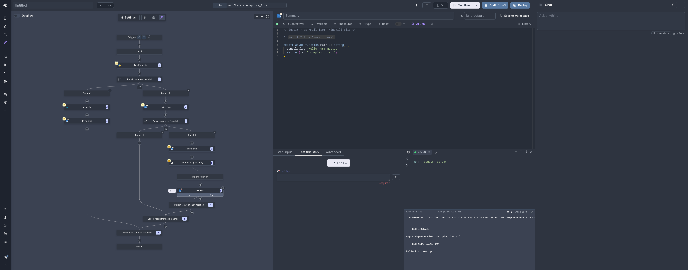

<!-- theme: default -->
<!-- class: invert -->

<script type="module">
  import mermaid from 'https://cdn.jsdelivr.net/npm/mermaid@10/dist/mermaid.esm.min.mjs';
  mermaid.initialize({ startOnLoad: true });
</script>

# Building a Mini Windmill 🚀

## A Deep Dive into Ultra Fast, Reliable Worflow Engines in Rust

---

# Windmill

- Open-source workflow engine and developer platform
- 300+ Enterprise customers (medium to public companies)
- 3000+ open-source instances
- 30k+ users
- 10k+ jobs executed every second



---

# What We're Building Today

- 🎯 State Machine for Jobs & Workflows
- 💾 Persistence Layer using PostgreSQL
- 🧟 Zombie Jobs & Recovery

Bonus:

- 📡 Live Log Streaming

---

# Part 1: The Foundation

## Finite State Machines all the way

<div  style="margin-left: 250px;">
<div class="mermaid">
stateDiagram-v2
    [*] --> Queued
    Queued --> Running: start()
    Running --> Completed: success()
    Running --> Failed: error()
    Running --> Cancelled: cancel()
    Completed --> [*]
    Failed --> [*]
    Cancelled --> [*]
</div>
</div>

For individual jobs

---

# Core Job Structure

```rust
#[derive(Debug, Clone, PartialEq)]
pub enum JobStatus {
    Queued,
    Running,
    Completed,
    Failed,
    Cancelled,
}

pub struct Job {
    pub id: Uuid,
    pub script_content: String,
    pub status: JobStatus,
    pub created_at: DateTime<Utc>,
    pub result: Option<serde_json::Value>,
}
```

---

# Getting the Next Job

```rust
impl JobStateMachine {
    pub async fn get_next_queued_job(&self) -> Option<Uuid> {
        let jobs = self.jobs.read().await;

        // Find oldest queued job
        jobs.values()
            .filter(|job| job.status == JobStatus::Queued)
            .min_by_key(|job| job.created_at)
            .map(|job| job.id)
    }
}

// Worker loop
let job_id = state_machine.get_next_queued_job().await?;
state_machine.transition_to_running(job_id).await?;
```

---

# Transitioning to Running

```rust
impl JobStateMachine {
    pub async fn transition_to_running(&self, job_id: Uuid)
        -> Result<(), JobError>
    {
        let mut jobs = self.jobs.write().await;
        let job = jobs.get_mut(&job_id)?;

        match job.status {
            JobStatus::Queued => {
                job.status = JobStatus::Running;
                job.started_at = Some(Utc::now());
                self.emit_event(JobEvent::Started(job_id))?;
                Ok(())
            }
            _ => Err(JobError::InvalidTransition)
        }
    }
}
```

---

# Key Design Decisions ✨

**Immutable Transitions**

- Validate → Commit
- No partial states
- Atomic operations **Event-Driven**
- Every change = event
- Enable observability
- Decouple components

---

# FSM for Flows

## Orchestrating Sequential Jobs

<div style="display: flex; justify-content: center; align-items: center; min-height: 300px;">
<div class="mermaid">
stateDiagram-v2
    [*] --> WorkflowQueued
    WorkflowQueued --> WorkflowRunning: start()
    WorkflowRunning --> WorkflowCompleted: all jobs done
    WorkflowRunning --> WorkflowFailed: job failed
    WorkflowRunning --> WorkflowCancelled: cancel()
    WorkflowCompleted --> [*]
    WorkflowFailed --> [*]
    WorkflowCancelled --> [*]
</div>
</div>

---

# Workflow Definition vs Status

```rust
// Workflow template - what to execute
pub struct WorkflowDefinition {
    pub id: Uuid,
    pub jobs: Vec<JobDefinition>,
}

pub enum JobDefinition {
    Script { content: String },
    Workflow { workflow_id: Uuid }, // Nested workflow!
}

// Workflow execution state
pub struct WorkflowStatus {
    pub id: Uuid,
    pub definition_id: Uuid,
    pub status: WorkflowState,
    pub jobs: Vec<Uuid>, // Job IDs created for this execution
    pub current_index: usize,
    // status can also be reprensented as a vec of <(Uuid, WorkflowState)>
}
```

---

# Workflow Execution Logic

```rust
impl WorkflowExecutor {
    pub async fn execute_workflow(&self, def_id: Uuid) -> WorkflowStatus {
        let definition = self.get_definition(def_id).await?;
        let mut status = WorkflowStatus::new(definition.id);

        // Create jobs for each step
        for job_def in &definition.jobs {
            let job_id = match job_def {
                JobDefinition::Script { content } => {
                    self.create_job(content.clone()).await?
                }
                JobDefinition::Workflow { workflow_id } => {
                    // Recursive workflow execution!
                    self.create_workflow_job(*workflow_id).await?
                }
            };
            status.jobs.push(job_id);
        }

        // Execute jobs in sequence
        for (idx, &job_id) in status.jobs.iter().enumerate() {
            status.current_index = idx;

            // Job status is tracked in job table, not duplicated here
            let job_status = self.wait_for_job(job_id).await?;

            if job_status != JobStatus::Completed {
                status.status = WorkflowState::Failed;
                break;
            }
        }

        status
    }
}
```

---

# Part 2: Adding Persistence

## The Database Schema

```sql
CREATE TABLE jobs (
    id UUID PRIMARY KEY,
    script_content TEXT NOT NULL,
    status VARCHAR(20) NOT NULL DEFAULT 'queued',
    created_at TIMESTAMPTZ NOT NULL DEFAULT NOW(),
    result JSONB,
    error TEXT
);

-- Critical for performance!
CREATE INDEX idx_jobs_status_created_at
    ON jobs (status, created_at);
```

---

# Queue: The Magic of `SKIP LOCKED` 🔒

```sql
UPDATE jobs
SET status = 'running', started_at = NOW()
WHERE id = (
    SELECT id FROM jobs
    WHERE status = 'queued'
    ORDER BY created_at
    FOR UPDATE SKIP LOCKED  -- ← The secret sauce!
    LIMIT 1
)
RETURNING *;
```

**Result**: Multiple workers, zero conflicts! 🎉

Is it performant? 10k+ jobs/sec, that's more than you will ever need on a single
instance. For more, you shard.

---

## Persistence

- Jobs, Workflows, Logs are stored on the same database
- Workers are while loop that poll for jobs
- Jobs are updated in transactions
- When a job is completed, we update the workflow status and push the next job

## Invariance

- Workers pull for jobs in a loop, jobs can represent a workflow, or a script
- When a job that is part of a workflow is completed, we update the workflow
  status and push the next job. That's it

---

# Part 3: Zombie Jobs/Workflows 🧟

Oops, your worker crashed, or your network went down, or your computer exploded.

What happens to your jobs?

They are stuck in a running state, and will never complete.

We need to detect this and recover them.

---

# Heartbeat-Based Detection

Add a regular ping from worker, and detect when you expect progress and none is
happening

```rust
async fn detect_zombies(&self) -> Result<()> {
    let timeout = Utc::now() - Duration::seconds(30);

    let zombies = sqlx::query!(
        "SELECT id FROM jobs
         WHERE status = 'running'
         AND last_ping_at < $1",
        timeout
    ).fetch_all(&self.pool).await?;

    for zombie in zombies {
        self.recover_zombie(zombie.id).await?;
    }
    Ok(())
}
```

---

### Recover zombie

job or workflow is in recoverable state, e.g can be retried, sent to another
worker in the last known state.

That's why FSM are so important, they allow us to recover from any state.

---

# Part 4: Live Log Streaming 📡

---

Logs are streamed from the forked process, buffered and then sent to postgresql.
Once they reach a certain size, they are flushed to s3.

---

# Performance Optimization

## Log Batching for High Throughput

```rust
// Instead of: 1000 individual inserts
// Do: 1 batch insert of 1000 rows

let mut batch = Vec::new();
for log in incoming_logs {
    batch.push(log);
    if batch.len() >= 100 {
        self.flush_batch(batch).await?;
        batch = Vec::new();
    }
}
```

**Result**: 10x throughput improvement! 🚀

---

# Part 5: Putting It All Together

```rust
pub struct MiniWindmill {
    store: PersistentJobStore,
    log_streamer: Arc<LogStreamer>,
    zombie_detector: ZombieJobDetector,
    error_recovery: ErrorRecoveryManager,
    worker_pool: WorkerPool,
}
```

---

# Scaling Beyond Mini-Windmill

**Next Challenges**:

- Branch one, branch all, for loop, while loop, approval/suspend steps
- Sharding, fine grained error handling, observability, metrics, tracing, etc.

---

# Lessons Learned

> "Complexity is the enemy of reliability"

- Start with a simple state machine
- Add persistence thoughtfully
- Design for random failures from day one

---

# Demo Time! 🎮

<https://youtu.be/eLPGqUNJ2G8>

---

# Questions? 🤔

## Resources

https://github.com/windmill-labs/windmill

---

# Thank You! 🙏

## Happy Building! 🚀
